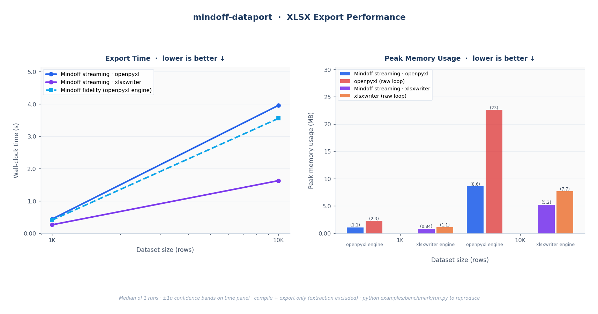
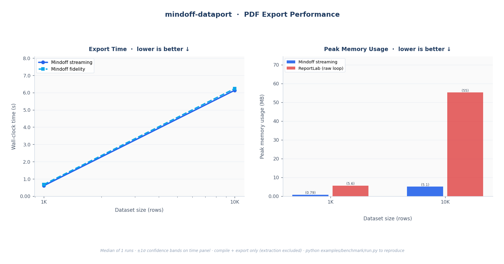

# Benchmarking

Performance claims should be reproducible, not rhetorical. This page explains exactly how `mindoff-dataport` is measured, what the numbers mean, and how to run the same benchmark on your own machine. The headline is simple: **streaming mode holds near-constant peak memory regardless of dataset size**, while raw library loops grow linearly with the data.

## The Claim

> Streaming mode holds near-constant peak memory as dataset size grows. Raw library loops are O(n) in peak memory; streaming is roughly O(1). Runtime is linear for both. Adding the template-driven compile step costs something; the benchmarks show how much.

The comparison is against the most direct alternative: writing the same styled output by hand with raw `openpyxl`, `xlsxwriter`, and `ReportLab` loops. Those "manual styling" baselines hardcode every color, border, font, row height, and column width in Python; no template is read. They are the speed ceiling for pure writing with no design layer. Mindoff adds a compile step on top of that; the benchmark measures the cost of that template-driven convenience.

## Results

### 1. XLSX Export



**Fig. 1: XLSX export.** *Left:* wall-clock time for all Mindoff modes; both streaming and fidelity scale linearly (O(n)). *Right:* peak RSS; Mindoff streaming holds near-constant while the `openpyxl` and `xlsxwriter` raw loops grow with dataset size. Fidelity is excluded from the memory panel because it is an in-memory mode intended for smaller outputs, not a fair memory comparison.

### 2. PDF Export



**Fig. 2: PDF export.** *Left:* wall-clock time; linear O(n) scaling. *Right:* peak RSS; Mindoff streaming versus the ReportLab raw loop.

## Methodology

| Aspect          | Detail |
|-----------------|--------|
| **What's timed** | `compile()` + `export()` combined. Template `extract()` is excluded; it's a one-time setup cost. |
| **Metric**       | Median of repeated runs; shaded bands show ±1σ across runs. |
| **Data**         | Synthetic 5-column Parquet (int, str, str, float, date). |
| **Baselines**    | Raw `openpyxl` / `xlsxwriter` / `ReportLab` loops applying identical layout and styling cell by cell. |
| **Warm-up**      | One warm-up pass is discarded before measurement, to avoid cold-import and OS file-cache effects. |
| **Fairness**     | Baselines render the same visible data, report structure, and style intent as the template-driven output. Saved artifacts are refreshed at the start of each run so comparisons never mix old and new outputs. |

### Why Memory Is the Story

Streaming reads Parquet in batches (default 50K rows) and writes incrementally, so peak RSS barely moves as rows scale. The raw library loops load the full dataset into memory before writing, so their peak RSS climbs in step with the data. For large exports, that's the difference between a job that fits in a container and one that gets killed by the OOM reaper.

### What Is *Not* Measured

- **Template design-time productivity**: how fast a team can build or change a report layout in Excel. This is arguably the library's biggest win, but it isn't a runtime number.
- **Template extraction / schema creation**: a one-time step, excluded from timed results.

### Method Set

**XLSX**

| Method | What it does |
|---|---|
| mindoff fidelity | Template-driven workflow, full style fidelity |
| mindoff streaming-openpyxl | Template-driven workflow, streaming output |
| mindoff streaming-xlsxwriter | Template-driven workflow, streaming with the xlsxwriter engine |
| openpyxl (manual styling) | Raw openpyxl write, all styles hardcoded in Python |
| xlsxwriter (manual styling) | Raw xlsxwriter write, all styles hardcoded in Python |

**PDF**

| Method | What it does |
|---|---|
| mindoff fidelity | Template-driven PDF export without an explicit chunk override |
| mindoff streaming | Template-driven PDF export with `streaming_chunk_rows` chunking |
| reportlab (manual styling) | Raw ReportLab report with the same title, table, sizing, and styles hardcoded in Python |

## Run It Yourself

The benchmark ships with the repository under `examples/benchmark/`.

```bash
# Quick dev run (2 row scales, 1 run, no warm-up)
python examples/benchmark/run.py --quick

# Full publish run (4 XLSX scales up to 500K rows, 5 runs, warm-up enabled)
python examples/benchmark/run.py --full

# Custom override
python examples/benchmark/run.py --runs 3 --timeout 180

# Guard: fail if fidelity XLSX is not a speed winner vs openpyxl at 1K/10K
python examples/benchmark/assert_fidelity_speed.py
```

If the benchmark template is missing, regenerate it first:

```bash
python examples/benchmark/create_template.py
```

### Output Artifacts

| File | Description |
|---|---|
| `output/results.csv` | Results per method and row count: std dev, compile time, rows/s, output path, peak MB per 10K rows, file MB per 10K rows |
| `output/files/` | Representative XLSX and PDF outputs from the final measured run for each method and row count, grouped by format |

<div class="admonition tip">
<p class="admonition-title">Reading the numbers in context</p>
<p>The right way to choose a mode isn't "which is fastest" but "which fits my data." For modest reports, fidelity gives you every feature at competitive speed. For large or unbounded exports, streaming trades a few features for a memory profile that simply doesn't grow. The <a href="../developer_guide/exporting-xlsx.md">Exporting to Excel</a> guide has the decision table.</p>
</div>
